<!-- ═══ TOP DIVIDER ═══════════════════════════════════════════ -->
<picture>
  <source media="(prefers-color-scheme: dark)"  srcset="https://capsule-render.vercel.app/api?type=rect&height=2&color=333333" />
  <source media="(prefers-color-scheme: light)" srcset="https://capsule-render.vercel.app/api?type=rect&height=2&color=ebebeb" />
  
</picture>

 

<!-- ═══ NAME ══════════════════════════════════════════════════ -->
<picture>
  <source media="(prefers-color-scheme: dark)"
    srcset="https://readme-typing-svg.demolab.com?font=Geist+Mono&weight=500&size=40&duration=3000&pause=800&color=ffffff&center=true&vCenter=true&width=600&lines=Andrew+Velox;Mohabbat" />
  <source media="(prefers-color-scheme: light)"
    srcset="https://readme-typing-svg.demolab.com?font=Geist+Mono&weight=500&size=40&duration=3000&pause=800&color=171717&center=true&vCenter=true&width=600&lines=Andrew+Velox;Mohabbat" />
  
</picture>

<!-- ═══ ROLE ═══════════════════════════════════════════════════ -->
<picture>
  <source media="(prefers-color-scheme: dark)"
    srcset="https://readme-typing-svg.demolab.com?font=Geist+Mono&weight=500&size=14&duration=2000&pause=1000&color=888888&center=true&vCenter=true&width=520&lines=CSE+Student+%E2%80%94+Green+University;CPP+%C2%B7+Python+%C2%B7+Django" />
  <source media="(prefers-color-scheme: light)"
    srcset="https://readme-typing-svg.demolab.com?font=Geist+Mono&weight=500&size=14&duration=2000&pause=1000&color=808080&center=true&vCenter=true&width=520&lines=CSE+Student+%E2%80%94+Green+University;CPP+%C2%B7+Python+%C2%B7+Django" />
  
</picture>

 
<!-- ═══ SOCIAL BADGES ══════════════════════════════════════════ -->
<a href="https://www.linkedin.com/in/mohabbatvlx/">
  <picture>
    <source media="(prefers-color-scheme: dark)"  srcset="https://img.shields.io/badge/LinkedIn-ffffff?style=flat-square&logo=linkedin&logoColor=171717" />
    <source media="(prefers-color-scheme: light)" srcset="https://img.shields.io/badge/LinkedIn-171717?style=flat-square&logo=linkedin&logoColor=ffffff" />
    
  </picture>
</a>
&nbsp;
<a href="https://discord.com/users/mohabbat_v3">
  <picture>
    <source media="(prefers-color-scheme: dark)"  srcset="https://img.shields.io/badge/Discord-ffffff?style=flat-square&logo=discord&logoColor=171717" />
    <source media="(prefers-color-scheme: light)" srcset="https://img.shields.io/badge/Discord-171717?style=flat-square&logo=discord&logoColor=ffffff" />
    
  </picture>
</a>
&nbsp;
<a href="https://www.youtube.com/@Veloxofcl">
  <picture>
    <source media="(prefers-color-scheme: dark)"  srcset="https://img.shields.io/badge/YouTube-ffffff?style=flat-square&logo=youtube&logoColor=171717" />
    <source media="(prefers-color-scheme: light)" srcset="https://img.shields.io/badge/YouTube-171717?style=flat-square&logo=youtube&logoColor=ffffff" />
    
  </picture>
</a>
&nbsp;
<a href="https://www.facebook.com/mohabbat404">
  <picture>
    <source media="(prefers-color-scheme: dark)"  srcset="https://img.shields.io/badge/Facebook-ffffff?style=flat-square&logo=facebook&logoColor=171717" />
    <source media="(prefers-color-scheme: light)" srcset="https://img.shields.io/badge/Facebook-171717?style=flat-square&logo=facebook&logoColor=ffffff" />
    
  </picture>
</a>
&nbsp;
<a href="mailto:mohabbat.bd2020@gmail.com">
  <picture>
    <source media="(prefers-color-scheme: dark)"  srcset="https://img.shields.io/badge/Gmail-ffffff?style=flat-square&logo=gmail&logoColor=171717" />
    <source media="(prefers-color-scheme: light)" srcset="https://img.shields.io/badge/Gmail-171717?style=flat-square&logo=gmail&logoColor=ffffff" />
    
  </picture>
</a>

  <!-- 

  

 -->
<!--  

  &nbsp;
  &nbsp; -->
<!--   &nbsp; -->
<!-- &nbsp;

 -->
<!-- 

  
  
  </a> -->
<!-- 

 -->

<!--  -->

    
  
  
  
  
  
  
  

<h2 align="center">⚔ Languages-Frameworks-Tools ⚔</h2>
 

<table>

<table align="center">
    <td align="center" width="96">
         
    </td>
    <td align="center" width="96">
         
    </td>
    <td align="center" width="96">
         
    </td>
    <td align="center" width="96">
         
    </td>
    <td align="center" width="96">
        
    </td>
	<td align="center"  width="96">
        
    </td>
	<td align="center" width="96">
        
    </td>
    
  </tr>

  <tr>
    <td align="center" width="96">
        
    </td>
	  <td align="center" width="96">
        
    </td>
    <td align="center" width="96">
        
    </td>
    <td align="center" width="96">
        
    </td>
      <td align="center" width="96">
        
    </td> 
	 <td align="center" width="96">
		
	</td>
    <td align="center"  width="96">
        
    </td>
  </tr>
 <tr>     
	<td align="center" width="96">
	    
	</td>
	<td align="center" width="96">
	    
	</td>
	<td align="center" width="96">
	    
	</td>
	<td align="center" width="96">
	    
	</td>
	<td align="center" width="96">
	    
	</td>
	<td align="center" width="96">
	    
	</td>
	<td align="center" width="96">
	    
	</td>
</tr>
</table>
</table>

 

---

<h2 align="center">💻 Competitive programming 💻</h2>
 

 

<h4 align="center">Made with  by <a href="https://github.com/andrew-velox">Mohabbat</a></h4>
